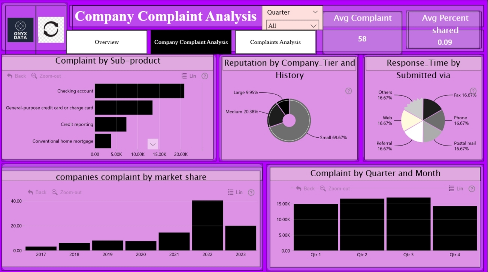

# Onyx-Data-October-2025-Consumer-Financial-Complaints-Report-Challenge

# 🧾 Onyx Data Challenge – October 2025  
**Consumer Financial Complaints Report | Power BI Submission by Gyanankur Baruah**

---

## 📊 Challenge Overview  
This report was created for the **Onyx Data Challenge – October 2025**, hosted in collaboration with **DataDNA**, **ZoomCharts**, **Smart UI**, **Career Jumpstart**, and **BCS Chartered**. The challenge focused on analyzing consumer financial complaints across products, companies, states, and time periods.

Using **Power BI**, I built a 3-page interactive report that helps stakeholders understand complaint patterns, response times, and company performance. The goal was to uncover actionable insights that can improve customer service, regulatory compliance, and operational transparency.

---

## 📁 File Structure  
- `DataDNA Power BI Dashboard.pbix` – Power BI report file  
- `Onyx October 2025.pdf` – PDF version of the report  
- `1000099207-Picsart-AiImageEnhancer.jpg` – Collage of all 3 report pages  
- `IMG_20251023_113727.jpg` – Page 1: Overview  
- `IMG_20251023_113754.jpg` – Page 2: Company Complaint Analysis  
- `IMG_20251023_113828.jpg` – Page 3: Complaint Analysis  
- `README.md` – This documentation file

---

## 📄 Report Pages

### 🔹 Page 1: Overview  

- Total Complaints: 44,392  
- Average Response Time: 15.09 days  
- Complaint Distribution by Product, State, and Year  
- Map of complaint density across U.S. states  
- Response time comparison by timely response status

This page provides a high-level summary of complaint volumes, geographic patterns, and response efficiency.

---

### 🔹 Page 2: Company Complaint Analysis  

- Average Percent Closed: 80.00%  
- Complaint Breakdown by Sub-product and Submission Method  
- Company-wise complaint history and resolution time  
- Filters for Quarter and Year

This page evaluates how companies handle complaints, highlighting resolution rates and submission channel performance.

---

### 🔹 Page 3: Complaint Analysis  

- Complaint Trends by Census Region  
- Sub-issue breakdown via pie chart  
- Monthly complaint volume via scatter plot  
- Filters for Quarter, Year, and Region

This page dives into complaint types and regional patterns, helping identify recurring issues and underserved areas.

---

## 📌 Key Insights Uncovered  
- Products with highest complaint volumes  
- States with most and least complaints  
- Year-over-year trends in complaint frequency  
- Companies with fastest and slowest response times  
- Sub-issues driving the majority of complaints  
- Submission methods linked to longer resolution times  
- Regional disparities in complaint types and volumes

---

## ✅ Technical Details  
- Built in Power BI  
- Canvas size: 1920x1080 (Full HD)  
- Report length: 3 pages  
- Submission date: October 2025

---

## 📣 Conclusion  
This report was designed to support data-driven improvements in consumer complaint handling. By visualizing complaint patterns and company performance, it empowers regulators and service providers to act with clarity and precision.

**Made by:** Gyanankur23  
**LinkedIn:** [Follow me here](https://www.linkedin.com/in/gyanankur-baruah-797205338?utm_source=share&utm_campaign=share_via&utm_content=profile&utm_medium=android_app)

Special thanks to **BCS Chartered**, **Smart UI**, **Career Jumpstart**, **DataDNA Group**, **Onyx Data**, and **ZoomCharts** for hosting this challenge.